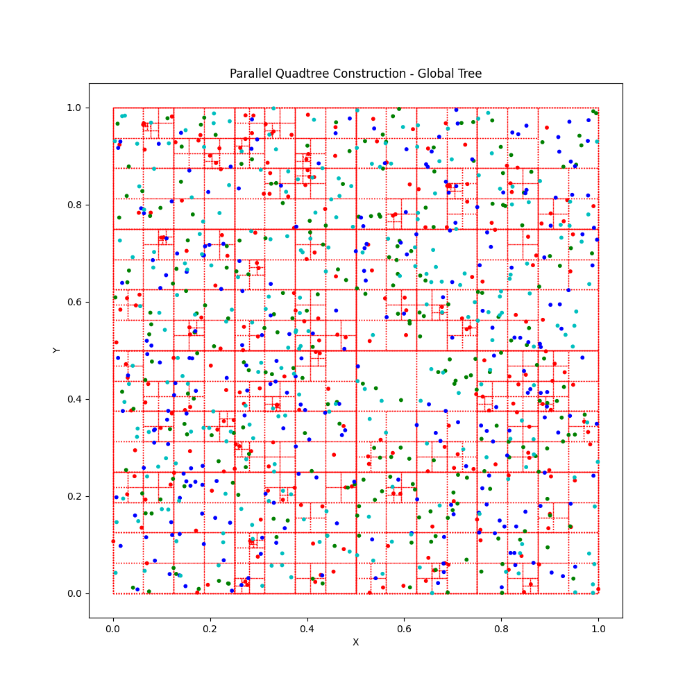

# Parallel Octree Construction with MPI

This project demonstrates the parallel construction of an Octree using MPI (Message Passing Interface). The C code distributes a set of 3D points among multiple processes, and each process builds an Octree for its local data. A Python script is included to visualize the results.

## Algorithm

The parallel Octree construction algorithm is implemented as follows:

### 1. Data Distribution

- The root process (rank 0) generates a set of random 3D points.
- These points are then scattered among all available MPI processes using `MPI_Scatter`. Each process receives an equal portion of the data.

### 2. Local Tree Construction

- Each process constructs an Octree for its local set of points. The tree is built recursively:
    - If the number of points in a node exceeds a certain threshold (`MAX_POINTS_PER_NODE`), the node is subdivided into eight children (octants).
    - The points in the parent node are then redistributed among the children based on their spatial location.
    - This process continues until all points are stored in leaf nodes that do not exceed the point capacity.

### 3. Combining Local Trees

After each process has built its local Octree (or Quadtree), the root process (rank 0) collects these local tree structures and reconstructs a single, globally consistent tree. This process involves:

1.  **Serialization:** Each process traverses its local tree and serializes its nodes into a flat array of `SerializedNode` structs. Each `SerializedNode` contains the node's center, size, the rank of the process that created it, and indices to its children within the serialized array.
2.  **Gathering:** The root process uses `MPI_Gather` to collect the size of each serialized local tree and `MPI_Gatherv` to collect all the serialized node data from all processes into a single, large array.
3.  **Reconstruction:** The root process then reconstructs the global tree from this combined serialized data. It iterates through the `all_serialized_nodes` array, creating `OctreeNode` (or `QuadtreeNode`) objects and linking them based on the child indices stored in the `SerializedNode`s. This effectively stitches together the distributed tree parts into a unified global tree.

## Basic Usage

1. **Compile the C code:**

   ```bash
   make
   ```

2. **Run the parallel executable (Octree):**

   ```bash
   mpirun -np 4 ./octree_parallel
   ```

   This will generate data files (`points_data_rank_*.txt` and `octree_data_global.txt`).

3. **Generate the Octree visualization:**

   ```bash
   python3 plot.py
   ```

   This will create a 3D plot of the distributed data and the global Octree, saved as `octree_visualization_global.png`.

4. **Run the parallel executable (Quadtree):**

   ```bash
   mpirun -np 4 ./quadtree_parallel
   ```

   This will generate data files (`points_data_rank_*.txt` and `quadtree_data_global.txt`).

5. **Generate the Quadtree visualization:**

   ```bash
   python3 plot_quadtree.py
   ```

   This will create a 2D plot of the distributed data and the global Quadtree, saved as `quadtree_visualization_global.png`.

6. **Clean up generated files:**

   ```bash
   make clean
   ```

## Quadtree Visualization Demo


